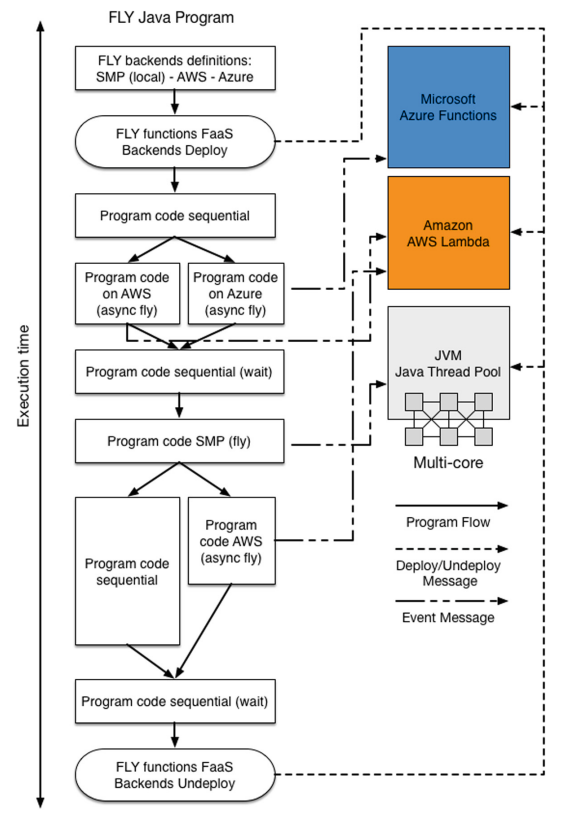

# Overview
{:.no_toc}

The goal of FLY is to provide a portable, scalable and easy-to-use programming environment for scientific computing. 
{: .fs-6 .fw-300 }

1. TOC 
{:toc}

## Idea

FLY perceives a cloud computing infrastructure as a
parallel computing architecture on which it is possible to execute some parts of its execution flow in parallel. FLY enables the domain developers (i.e., domain experts with
limited knowledge about complex parallel and distributed systems) to design their applications exploiting data and task parallelism on any FlS architecture. This is achieved
by a rich language that provides domain-specific constructs, that enable the developers
to easily interact, using an environment abstraction, with different FaaS back-ends.

## FLY Environments

FLY provides implicit support for parallel and distributed computing paradigms and
memory locality, enabling the users to manage and elaborate data on a cloud environment without the effort of knowing all the details behind cloud providers API. A FLY
program is executable either on a SMP or a cloud infrastructure (supporting FaaS) without a deep knowledge of the underlying computing resources.
FLY is compiled in native code (Java code) and it is able to automatically exploit
the computing resources available that better fit its computation requirements. 

## FLY Functions

The main innovative aspect of FLY is represented by the concept of FLY function. A FLY
function can be seen as an independent block of code, that can be executed concurrently. FLY functions can be executed in sequential mode, in parallel on SMP or on a
FaaS back-end. 

## Channels

The language provides programming constructs for functions definition, execution, synchronization and communication. Communication among different
environments/back-ends is obtained through some virtual communication path named
channels. Along these lines FLY has been designed as an enhanced scripting language
and is composed by a sequence of standard instructions integrated with a number of
FLY functions invocation, which interact via channels.
