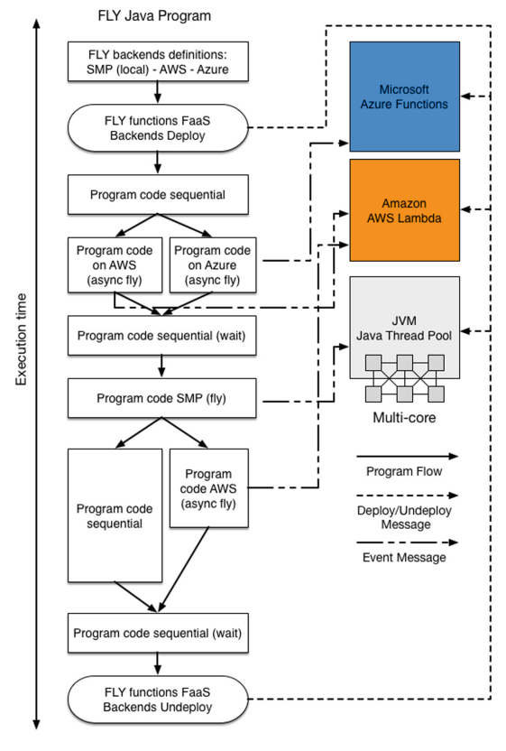

# Overview
{:.no_toc}

The goal of FLY is to provide a portable, scalable and easy-to-use programming environment for scientific computing.
Later on, all the concepts here described will be properly studied in deep.
{: .fs-6 .fw-300 }

## Table of contents
{: .no_toc .text-delta }

1. TOC 
{:toc}

## Idea

FLY perceives a cloud computing infrastructure as a
parallel computing architecture on which it is possible to execute some parts of its execution flow in parallel. FLY enables the domain developers (i.e., domain experts with
limited knowledge about complex parallel and distributed systems) to design their applications exploiting data and task parallelism on any FlS architecture. This is achieved
by a rich language that provides domain-specific constructs, that enable the developers
to easily interact, using an environment abstraction, with different FaaS back-ends.



## Basic concepts

### Types

FLY provides two sets of types named __basic__ and __domain__ types. __Basic__ types, inherited
by Java, comprises _boolean_, _integer_, _real_ (double point precision floats) and _string_.
Moreover, FLY supports __one/bi/three-dimensional array__ definition for basic types. In
addition to basic types, FLY provides several __domain__ types that enable the users to
interact and communicate with the computing back-ends.

FLY is a __strongly typed language__ since is based on Java backend. Once a variable is defined, can not be assigned a different type value to it.

### Variables and Constants

To define a new variable FLY provide the `var` clause, followed by  an assignment operator (`=`) and it's initialization right-value.

```js
var <identifier> = <value>
```

To define a new constant FLY provide instead the `val` clause, also 
followed by assignment operator and initialization value.

```golang
val <identifier> = <value>
```
Remember that constants are immutable, and can not change value after the initialization.

### Identifiers
Identifiers can be any kind of character either lowercase (a-z), or uppercase (A-Z). Other allowd characters are the underscore ( _ ) and digits (0-9).
Any identifier can not starts with a digit.

Each identifier it's __unique__ in the scope in which is defined, and can't be defined other variable with the same identifier in the same scope.

### Semicolon?

Even if FLY is based on Java, __no semicolon__ are needed at the end of each statement. Each statement just needs a new-line character to be isolated by the others.

## FLY Environments

FLY provides implicit support for parallel and distributed computing paradigms and
memory locality, enabling the users to manage and elaborate data on a cloud environment without the effort of knowing all the details behind cloud providers API. A FLY
program is executable either on a SMP or a cloud infrastructure (supporting FaaS) without a deep knowledge of the underlying computing resources.
FLY is compiled in native code (Java code) and it is able to automatically exploit
the computing resources available that better fit its computation requirements.

```js
var Cloud = [type="azure", client_id="", tenant_id="", secret_key="", subscription_id="", region="West Europe", language="python", nthreads=10, seconds=300]

var Local = [type="smp", nthreads=4]
```

## FLY Functions

The main innovative aspect of FLY is represented by the concept of FLY function. A FLY
function can be seen as an independent block of code, that can be executed concurrently. FLY functions can be executed in sequential mode, in parallel on SMP or on a
FaaS back-end.

```js
func pi(){	
   var r = [type="random"]
   var x = r.nextDouble()
   var y = r.nextDouble()
   var msg = 0
 
   if((x * x)+(y * y) < 1.0){msg = 1}
   ch!msg on cloud
}

func estimation(){
   var sum = 0
   var crt = 0
   for i in [0:10] {
       sum += ch? as Integer
       crt += 1
   }
   println "pi estimation: " + (sum*4.0) / crt
}

fly pi in [0:10] on Cloud thenall estimation
```

## Channels

The language provides programming constructs for functions definition, execution, synchronization and communication. Communication among different
environments/back-ends is obtained through some virtual communication path named
channels. Along these lines FLY has been designed as an enhanced scripting language
and is composed by a sequence of standard instructions integrated with a number of
FLY functions invocation, which interact via channels.

```js
var ch = [type="channel"] on Cloud
```
